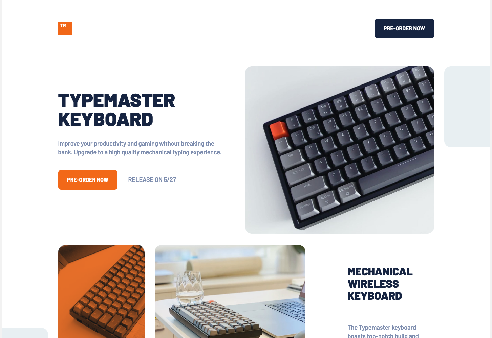

# Frontend Mentor - Typemaster pre-launch landing page solution

This is a solution to the [Typemaster pre-launch landing page challenge on Frontend Mentor](). Frontend Mentor challenges help you improve your coding skills by building realistic projects.

## Table of contents

- [Frontend Mentor - Typemaster pre-launch landing page solution](#frontend-mentor---typemaster-pre-launch-landing-page-solution)
  - [Table of contents](#table-of-contents)
  - [Overview](#overview)
    - [Screenshot](#screenshot)
    - [Links](#links)
  - [My process](#my-process)
    - [Built with](#built-with)
  - [Author](#author)

## Overview

### Screenshot

### Links

- Solution URL: [https://github.com/darpots/fm-typemaster](https://github.com/darpots/fm-typemaster)
- Live Site URL: [https://angry-albattani-74b02a.netlify.app/](https://angry-albattani-74b02a.netlify.app/
  )

## My process

### Built with

- [React](https://reactjs.org/) - JS library
- [Styled Components](https://styled-components.com/) - For styles
- Flexbox
- Mobile-first workflow

## Author

- Personal Website - [Darren Potter](https://www.darpots.dev)
- Frontend Mentor - [@darpots](https://www.frontendmentor.io/profile/darpots)
- Twitter - [@darpots](https://www.twitter.com/darpots)

